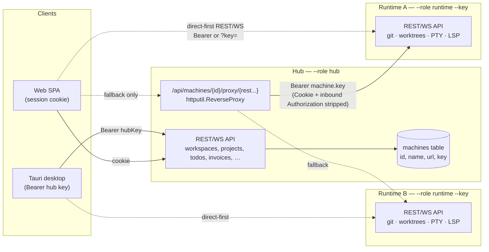
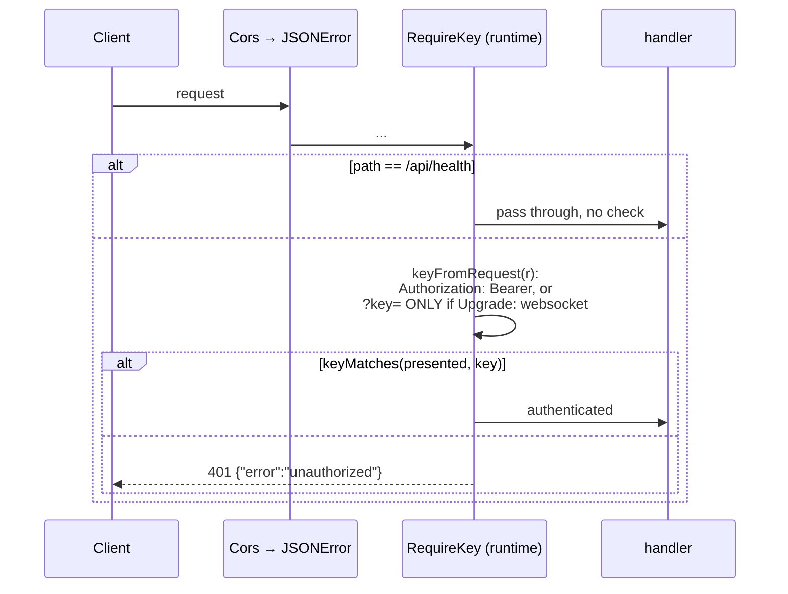

# Architecture

> Referenced from CLAUDE.md. Read when working on structure, request flow, DI, or
> adding a feature.

## Stack

| Layer | Technology |
|-------|-----------|
| Frontend | React 19, Vite 8, TypeScript 5.7 |
| Routing | TanStack Router (file-based, `src/routes/`) |
| UI | @base-ui/react v1, Tailwind v4, tw-animate-css, lucide-react |
| State | zustand (immer + persist→localStorage) |
| Server state | @tanstack/react-query |
| Terminal | xterm.js ↔ WebSocket → Go PTY gateway |
| Backend | Go 1.25, stdlib `net/http` (Go 1.22 enhanced mux) |
| Database | SQLite via modernc.org/sqlite (pure Go, no CGO) |
| WebSocket | nhooyr.io/websocket |
| PTY | go-pty: Unix PTY + Windows ConPTY (mock fallback when unavailable) |

## Request flow

```
Browser (xterm.js) ──WebSocket──→ /ws/terminal → terminal.Server → PTY/mock
Browser (fetch)    ──HTTP──────→ Vite proxy (:5173) → Go backend (:8989)
                                   /api/* → handler → service → store (port.Store) → SQLite
```

- Vite dev server proxies `/api` and `/ws/terminal` to the Go backend.
- Production builds embed the Vite output in the Go binary and serve the SPA,
  REST API, and WebSocket from the same loopback HTTP server.
- Handlers parse/validate, call services, delegate persistence to `port.Store`.
- Services own business logic; handlers own HTTP concerns.
- Middleware stack: `CorsMiddleware` → `JSONErrorMiddleware` → handler.
- Terminal sessions use native Unix PTYs on macOS/Linux and ConPTY on Windows
  10 version 1809 or newer.

## Hub / runtime roles

DevDeck is split into a **hub** (organizational source of truth: workspaces,
projects, invoices, …, machine registry) and per-machine **runtime**
backends (execution: git, worktrees, PTY) — one Go binary, selected at
startup via `--role hub|runtime|both` (see `COMMANDS.md`). All traffic rides
one Tailscale tailnet; clients connect direct-first to runtimes, with a hub
reverse proxy (`/api/machines/{id}/proxy/{rest...}`) as fallback for both
REST and WebSocket. `--role runtime` requires a static `--key` and serves
key-only auth (no session cookies, no embedded SPA, no auth/browser/seed
routes); `--role hub` keeps session-cookie auth and additionally accepts
that same style of bearer key for desktop (Tauri) clients. `--role both` is
a hub that also self-registers itself as its own execution Machine on
startup, for solo self-hosting without a separate runtime process — see
`docs/superpowers/specs/2026-07-14-hub-runtime-dual-role-and-polling-design.md`.
A runtime can also self-register with its hub on startup via
`--hub-url`/`--hub-key` instead of being added by hand through the Machines
UI — see `docs/superpowers/specs/2026-07-09-runtime-self-registration-design.md`.
The Tauri desktop app can do the same in the background when pointed at a
remote hub, deriving its own Tailscale public URL automatically — see
`docs/superpowers/specs/2026-07-16-desktop-remote-runtime-self-registration-design.md`.
See
`docs/superpowers/specs/2026-07-09-hub-runtime-tauri-design.md` for the full
design and `CONTRACTS.md` for the machines API and key-auth rules.

The five diagrams below trace how that split actually behaves at runtime,
each grounded in the current code (file:line refs point at
`backend/cmd/server/main.go`, `backend/internal/handler/{middleware,keyauth,
machine,machine_proxy}.go`, `frontend/src/lib/machineClient.ts`, and
`backend/internal/service/{worktree,workspace}.go` unless noted).

### System topology



Everything rides one Tailscale tailnet (not shown as a separate hop above —
see the design spec for the ACL/MagicDNS details); the diagram's solid vs.
dashed edges distinguish "always goes through the hub" from "direct-first,
proxy is the fallback path."

### Request auth: hub dual auth vs. runtime key-only

Both roles share the same middleware wrapping order, assembled once in
`main.go:358`: `CorsMiddleware(JSONErrorMiddleware(authMW(mux)))`, with
`AccessLog` always outermost (`main.go:376`) and `OnlyFrom` (IP allowlist)
outermost-but-one when `--only-from` is set. `authMW` is the one thing that
differs by role (`main.go:351-355`):

```mermaid
sequenceDiagram
    participant C as Client
    participant MW as Cors → JSONError
    participant Auth as RequireAuth (hub)
    participant H as handler

    C->>MW: request
    MW->>Auth: (CORS headers set; OPTIONS short-circuits 204)
    alt path is public (health, auth/config, auth/*, browser/proxy)<br/>or a non-API/non-WS SPA asset
        Auth->>H: pass through, no check
    else
        Auth->>Auth: keyMatches(keyFromRequest(r), hubKey)
        alt bearer/?key= matches (hubKey non-empty)
            Auth->>H: authenticated by key
        else no match, or hubKey unset
            Auth->>Auth: read session cookie, svc.CurrentUser(cookie)
            alt valid session
                Auth->>H: authenticated by cookie
            else missing/invalid
                Auth-->>C: 401 {"error":"unauthorized"}
            end
        end
    end
```

Key check runs **before** the cookie check and short-circuits on match
(`middleware.go:109-121`); an empty configured `hubKey` never matches
anything (`keyauth.go:34-36`), so an unset `--key` on the hub is exactly
today's cookie-only behavior.



Runtime auth is single-factor and has no `/api/auth/*` routes to fall back
to at all — they're never registered (`main.go:210-217`, gated on
`!isRuntime`). The `?key=` query-param path exists only for WebSocket
upgrades (`keyauth.go:27-29`) because the browser `WebSocket` constructor
can't set an `Authorization` header; every other request must use the
header, keeping keys out of URLs/logs.

### Direct-first client resolution (with proxy fallback)

`frontend/src/lib/machineClient.ts` decides direct-vs-proxy once per
machine and caches it for 30s (`MODE_TTL_MS`), so a burst of calls (e.g.
opening a worktree fires several queries at once) triggers one probe:

```mermaid
sequenceDiagram
    participant Call as machineApi.* call
    participant MC as machineClient.ts
    participant Cache as modeCache (30s TTL)
    participant M as Runtime machine
    participant Hub as Hub proxy (fallback)

    Call->>MC: machineRequest(machine, method, path, body)
    MC->>Cache: cached mode for machine.id fresher than 30s?
    alt cache hit
        Cache-->>MC: 'direct' | 'proxy'
    else cache miss/stale
        MC->>M: GET {machine.url}/api/health<br/>Bearer machine.key, 1.5s abort timeout
        alt res.ok
            MC->>Cache: store 'direct'
        else timeout or network error
            MC->>Cache: store 'proxy'
        end
    end
    alt mode == direct
        MC->>M: {method} {machine.url}/api{path}<br/>Authorization: Bearer machine.key
    else mode == proxy
        MC->>Hub: {method} /api/machines/{machine.id}/proxy/api{path}<br/>(hub session/cookie covers it, no key header)
        Hub->>M: reverse-proxied; Authorization replaced server-side with Bearer machine.key
    end
```

WebSocket URLs (`machineWsUrl`, used by `terminalWsUrl` and the LSP client)
go through the *same* cached resolution, but attach the key differently
since a browser `WebSocket` can't set headers: direct mode appends
`?key=machine.key` to the URL; proxy mode adds no key at all (the hub's own
session already authenticated the request before the proxy ever injects
the runtime key server-side).

### Creating a worktree on a runtime

One full request traced from the Spawn dialog to a real `git worktree add`
on disk:

```mermaid
sequenceDiagram
    participant U as SpawnDialog.submit()
    participant FE as machineApi.createWorktree
    participant MC as machineClient (direct-first)
    participant H as Runtime: PostWorktree
    participant S as WorktreeService.Create
    participant G as git CLI (gitpkg.AddWorktree)
    participant DB as Runtime SQLite

    U->>FE: {mode, branch, base, model, agent, task,<br/>path: project.path}<br/>machine resolved from project.machineId
    FE->>MC: POST /projects/{projectId}/worktrees
    MC->>H: resolved direct-or-proxy URL, Bearer/session
    H->>H: validate mode ∈ {root,branch}; path required (400 if missing)
    H->>S: Create(projectID, path, mode, branch, base, model, agent, task)
    alt mode == root
        S->>DB: CreateWorktree(...) — plain row, no git touched
    else mode == branch
        S->>G: git branch --format (ListBranches)
        S->>S: validate base exists; check sibling branch conflicts<br/>via WorktreesByProjectID
        S->>DB: CreateWorktree(...) first — need the generated id for the path
        S->>G: git worktree add -b branch path/.wt/id base
        alt git fails
            S->>DB: DeleteWorktree(id) — rollback
            S-->>H: error, DB never points at a nonexistent checkout
        end
    end
    H-->>FE: 200 domain.Worktree
    FE-->>U: navigate to /w/:wsId/p/:projectId/wt/:wtId
```

Disk layout convention: root-mode worktrees use the project's path
verbatim (plain shell terminal, no git checkout); branch-mode worktrees are
checked out at `<project.path>/.wt/<worktreeID>`, recomputed on demand
wherever it's needed (update/delete) rather than stored as-is.

### Hub federation of workspace listings

Worktrees are runtime-owned, so the hub's own `worktrees` table is
structurally empty for any project assigned to a machine. `GET /workspaces`
fans out concurrently to fetch live data instead of trusting local storage:

```mermaid
sequenceDiagram
    participant C as Client
    participant WS as WorkspaceService.List (hub)
    participant Store as Hub SQLite
    participant FC as machineclient.FetchWorktrees
    participant R1 as Runtime A
    participant R2 as Runtime B

    C->>WS: GET /workspaces
    WS->>Store: Workspaces() — full tree; worktrees empty for machine-assigned projects
    par one goroutine per project with machineId != ""
        WS->>FC: FetchWorktrees(machine A, projectID) [3s timeout]
        FC->>R1: GET /api/projects/{id}/worktrees, Bearer machine.key
        R1-->>FC: []Worktree
        FC-->>WS: proj.Worktrees = worktrees
    and
        WS->>FC: FetchWorktrees(machine B, projectID)
        FC->>R2: GET /api/projects/{id}/worktrees
        R2--xFC: unreachable / timeout
        FC-->>WS: error (logged) — proj.Worktrees left empty
    end
    WS-->>C: 200 workspaces — one dead machine never fails the whole request
```

Each goroutine writes into a distinct `*domain.Project` slice element
(pointers into the already-allocated `workspaces` tree), so no mutex is
needed — there's no shared mutable state between goroutines, only disjoint
per-element writes, followed by a single `wg.Wait()` before the response is
returned.

### Desktop (Tauri sidecar)

`frontend/src-tauri/` wraps the app for macOS/Windows/Linux: the Rust shell
spawns the Go binary as a sidecar hub (`--addr 127.0.0.1:0`, ephemeral
`--key`), parses the bound port from the listen line, upserts a local
Machine entry (terminals need one), and points the webview at the sidecar's
embedded UI with `?key=`, which `main.tsx` exchanges for a session cookie via
`POST /api/auth/key-session`. Spec:
`docs/superpowers/specs/2026-07-13-tauri-desktop-sidecar-design.md`.

### Forward proxy — reaching a runtime's loopback-only services

The diagrams above cover REST/WS traffic between clients and a runtime's own
API, but a worktree's dev server (e.g. `npm run dev`) binds to that
runtime's `127.0.0.1` — invisible to a browser running anywhere else, direct
or proxied. `backend/internal/netproxy` adds a fourth path, orthogonal to
the machine registry entirely: a plain SOCKS5 (`socks5.go`) and/or HTTP
(`httpproxy.go`) forward proxy, started opt-in via `--socks5-addr`/
`--http-proxy-addr` (+ `--proxy-key`) on *any* role — hub, runtime, or the
desktop sidecar — and dialing upstream from wherever that process runs.
Point a browser's proxy settings at a runtime's listener and it dials the
runtime's own loopback address, the same trick `ssh -D` plays for a remote
shell. See `COMMANDS.md`'s "Forward proxy for remote dev servers" for flags
and a worked example.

## Dependency wiring

- `backend/cmd/server/main.go` wires everything manually (no DI framework).
- `port.Store` is the single data-access interface; the only implementation is `store.Store` (SQLite).
- Agent registry is swappable: `registry.NewStaticRegistry()` (built-in) or `registry.NewJadiRegistry(url)` (remote).

## Directory map

```
backend/
  cmd/server/main.go          — entry point, wire-up, route registration
  internal/
    domain/models.go          — shared domain types (mirrors frontend types.ts)
    handler/                  — HTTP handlers (one file per resource + middleware)
    service/                  — business logic (one file per resource)
    service/tools.go          — Tools module: shells out to markitdown/pandoc/mmdc
    store/                    — SQLite persistence (implements port.Store)
    port/store.go             — Store interface + patch types
    port/registry.go          — Agent registry interface
    terminal/                 — WebSocket PTY gateway (server, pty, mock)
    registry/                 — Agent registry implementations (static, jadi)
    config/dotenv.go          — optional --env/.env loader (LLM creds for Tools)
  tools/venv/                 — gitignored Python venv for markitdown (see COMMANDS.md)
frontend/
  src/
    main.tsx                  — app entry (QueryClient + RouterProvider)
    routeTree.gen.ts          — GENERATED by TanStack Router plugin
    routes/                   — file-based routes (__root.tsx, w.$wsId.*.tsx)
    store/types.ts            — domain types (mirrors backend domain/models.go)
    store/useDevDeckStore.ts     — zustand store (immer + persist)
    store/seed.ts             — demo data
    lib/                      — api client, terminal client, utils, format, constants
    features/                 — feature modules (sidebar, agents, terminal, overlays, layout, branding)
    styles/globals.css        — Tailwind v4 import + CSS variables
  server/terminal-server.mjs  — legacy Node.js PTY gateway (replaced by Go backend)
```

## Terminal tiling workspace

Opening a worktree (`/w/$wsId/p/$projectId/wt/$wtId`) switches
`ExpandedTerminal` into a Wave-Terminal-style tiling workspace: a recursive
split-tree of resizable panes (`frontend/src/features/terminal/paneTree.ts`
for the pure tree model, `PaneCanvas.tsx` for rendering + drag-and-drop,
`PanelHeader.tsx` for the generic per-pane header), each holding Terminal /
Git / File / Explorer content. The global `Header` hides and `Sidebar`
collapses to a 44px icon rail while a worktree is open, detected purely from
the URL (`WORKSPACE_MODE_PATTERN` in `frontend/src/routes/w.$wsId.tsx`).
Layout (pane structure, split sizes, open tabs) persists client-side per
worktree via `useDevDeckStore`'s `worktreeLayouts` slice — no server-side
layout storage. Splitting a Terminal pane allocates a genuinely independent
PTY (`sessionKey = ${worktreeId}::term-${n}`); `backend/internal/terminal/
server.go`'s `resolveCommand` strips the `::term-N` suffix before its
`WorktreeByID` lookup so every pane resolves the same working directory and
agent as the primary pane. Full design, drag-and-drop zone math, and the
pane data model: `docs/superpowers/specs/2026-07-09-terminal-workspace-tiling-design.md`.

## Feature implementation order (canonical)

1. Define/update domain types in both `frontend/src/store/types.ts` and `backend/internal/domain/models.go` (keep them in sync).
2. Add store interface method in `backend/internal/port/store.go` (and patch types if needed).
3. Implement store method in `backend/internal/store/<resource>.go`.
4. Add service logic in `backend/internal/service/<resource>.go`.
5. Add handler in `backend/internal/handler/<resource>.go`.
6. Register route in `backend/cmd/server/main.go`.
7. Add API client function in `frontend/src/lib/api.ts`.
8. Add/update zustand store actions in `frontend/src/store/useDevDeckStore.ts`.
9. Build the UI in `frontend/src/features/<feature>/` and wire to a route in `frontend/src/routes/`.

## Deferred modules

News, Todos, and Invoices have their data model, store operations, and API endpoints fully wired. Their full UIs are deferred — routes render `DeferredModule` placeholders. These are the natural next pass.
